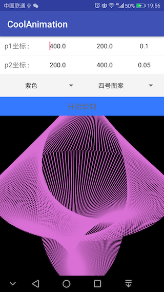

# CoolAnimation
该项目受某一篇文章启发。 通过两个点根据一定规律的运动绘制直线，从而绘制出非常炫酷的动画，遂自己写了一个demo。。

先上效果图：

        
        
        
        
        
        

关于原理

    这是一个极其简洁却又极富创意的规则。图形是由两个做圆周运动的点相连而成的，区别仅仅是圆的半径大小以及运行速度。
    当我们改变这几个参数，就会发生各种有趣的变化。如果我们把这两个点分别命名为点A和点B 那这几个参数分别是：

        A的运动角速度
        B的运动角速度
        A的X轴运动半径
        B的X轴运动半径
        A的Y轴运动半径
        B的Y轴运动半径

    我们把这几个参数设置不同的值，根据运动规律，它们便会画出不同的图案，效果你想都想不到哦！

扩展

    如果仅仅是黑白，视觉上仍有些单调。我们可以在原来规则的基础上添加一些变化，例如尝试在连线的节点上加入色彩。
    由于在Openframeworks上有一个简单的命令，仅仅通过 ofMesh 的 addColor() 和 addVertex(),可以很方便
    地在两点连线间产生自然的色彩过渡。所以下面的图形的生成都使用了OF，关键节点的颜色色相会随时间变化。

        
        
        

    If you like this library's design, feel it help to you, you can point the upper right corner "Star" support Thank you! ^ _ ^

